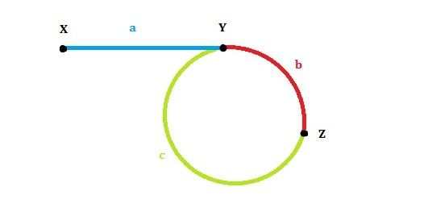

# Linked list cycle II

1. 利用unordered_set存储链表访问过的结点地址，一旦查找到说明回到了环的起点

    class Solution {
    public:
        ListNode *detectCycle(ListNode *head) {
            unordered_set<ListNode *> myset;
            while(head) {
                if (myset.find(head) != myset.end())
                    return *myset.find(head);
                myset.insert(head);
                head = head->next;
            }
            return NULL;
        }
    };

2. 利用slow和fast指针，和之前的区别在于：之前仅仅只需要找到环，但是这次需要将环的起点进行返回，所以需要额外进行一步—将fast重置为head，让head和slow一起前进，相遇即为环的起点。证明如下：

假设x为链表起点，y为环的起点，z为两指针相遇的地方，设xy相距为a，yz相距分别为b、c。可以知道，第一次相遇时，slow指针走过的距离为a+b，fast指针走过的为a+b+c+b，由于fast指针走的速度为slow指针的两倍，故走过的距离也是slow指针的两倍，所以可以得到2(a+b)=a+b+c+b⇒a=c，也就是说从相遇开始，重置指针fast(可以另外设一个指针)置起点X，slow不动，再次让两者同时向前走，只是速度都变为1，当二者再次相遇即走到了Y，也就是环的起点。 代码如下：

    class Solution {
    public:
        ListNode *detectCycle(ListNode *head) {
            ListNode *slow, *fast;
            slow = fast = head;
            if (!(head && head->next))  return NULL;
            while(fast && fast->next) {
                slow = slow->next;
                fast = fast->next->next;
                if (slow == fast) {
                    for (fast = head;;fast=fast->next,slow=slow->next)
                        if (fast == slow)
                            return slow;
                }
            }
            return NULL;
        }
    };